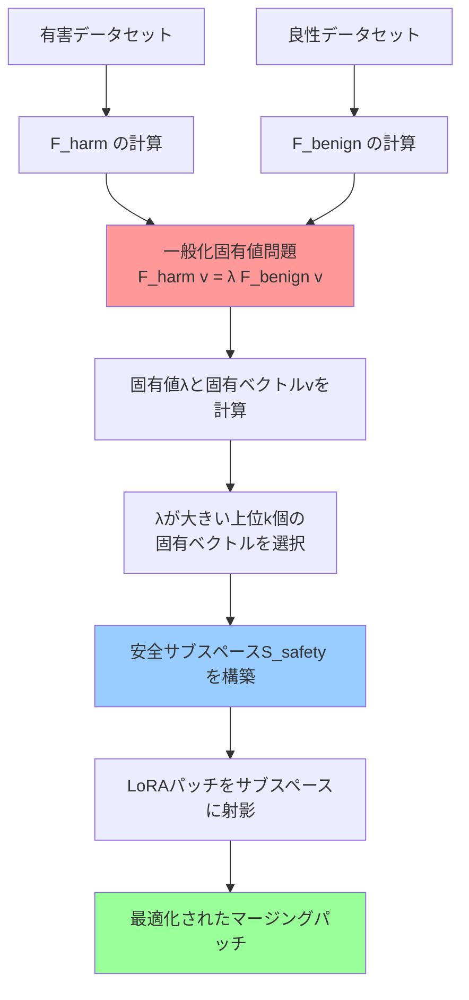
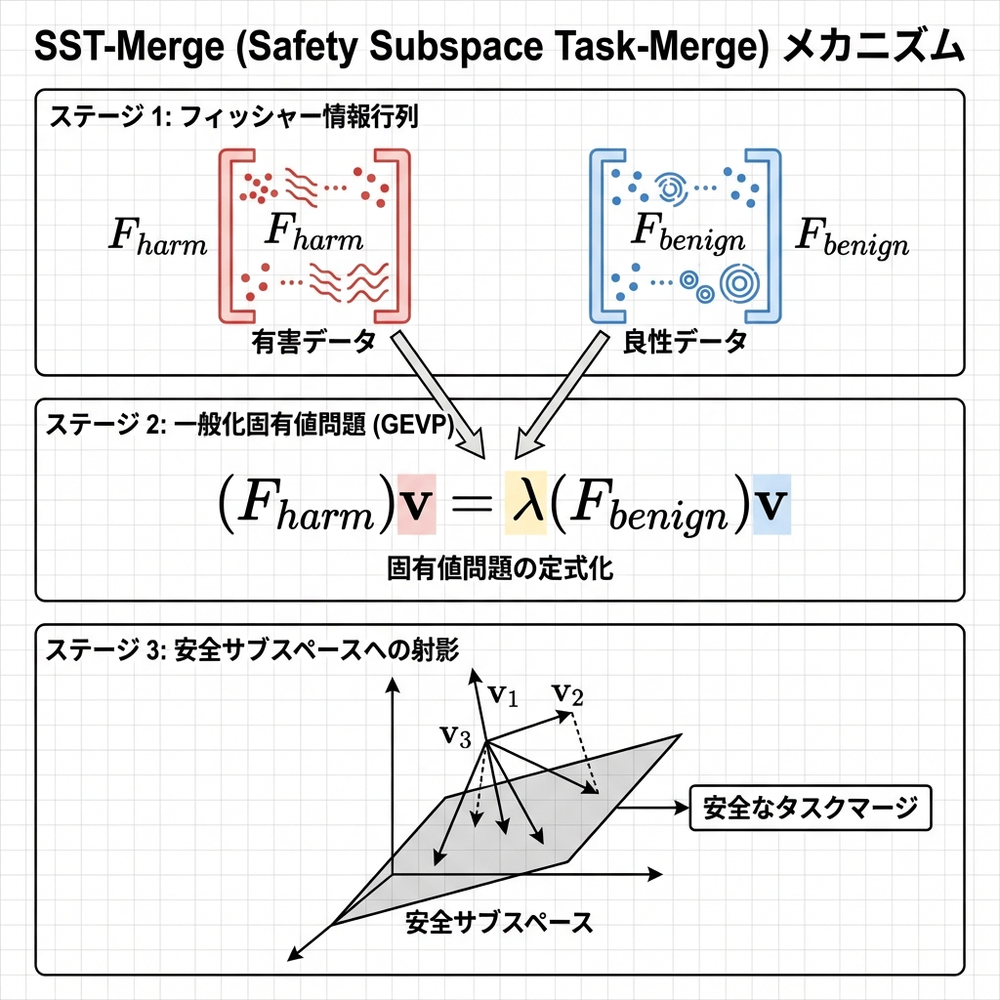
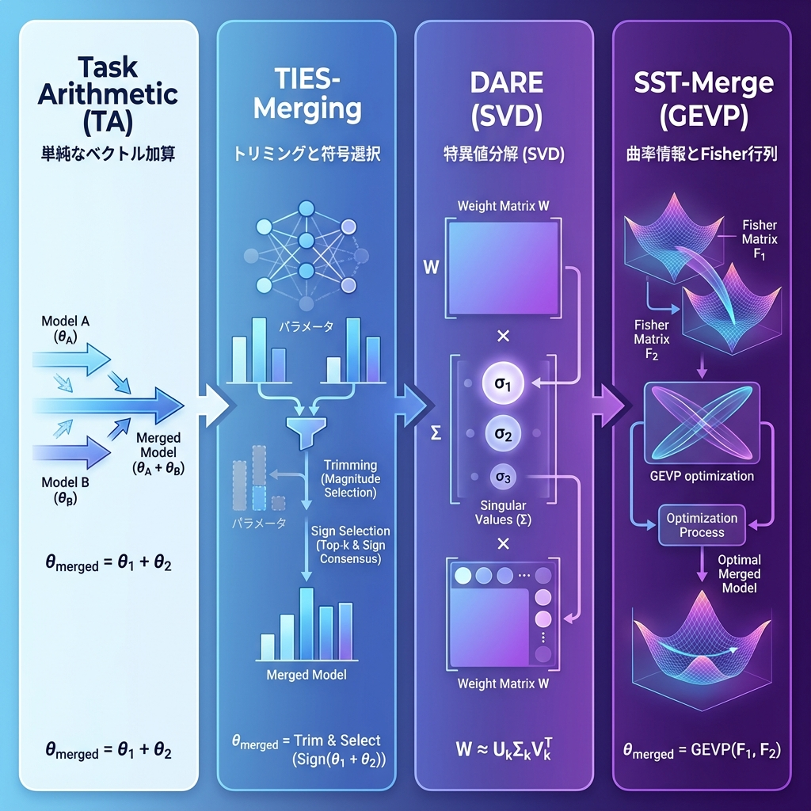
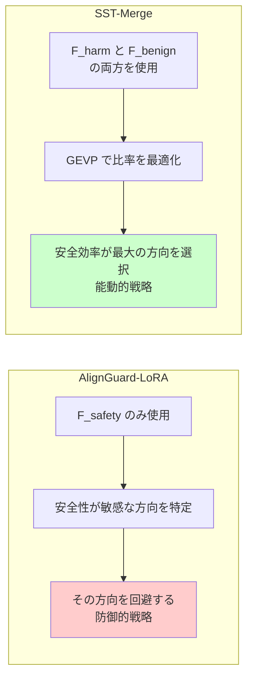
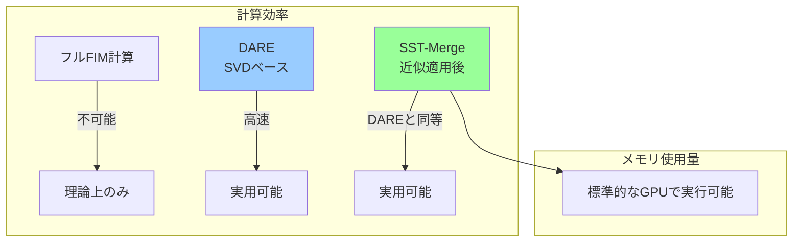
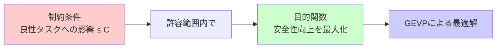
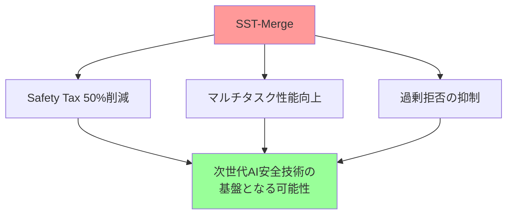

# SST-Merge（安全サブスペース選択型Task Arithmetic）わかりやすい解説レポート

## エグゼクティブサマリー

**SST-Merge（Safety Subspace Task-Merge）** は、大規模言語モデル（LLM）の安全性と有用性のトレードオフ問題を解決するための革新的なモデルマージング手法です。従来の手法が抱える「Safety Tax（安全性を高めると性能が落ちる）」という課題に対し、数学的に厳密なアプローチで解決を図ります。

### 主要な特徴
- 📊 **一般化固有値問題（GEVP）**を用いた最適化
- 🔒 **安全性向上**と**性能維持**を同時達成
- ⚡ **計算効率的**な実装が可能
- 🎯 **理論的に厳密**な数学的基盤

---

## 1. 背景：なぜSST-Mergeが必要なのか？

### 1.1 Safety Tax（安全税）問題

大規模言語モデルを安全にするためのファインチューニングを行うと、モデルの性能が著しく低下する現象が発生します。これを**Safety Tax**と呼びます。


**具体的な問題例：**
- 安全性アライメントを強化すると、推論精度が**30%以上低下**
- 無害な質問に対しても過剰に拒否する（Over-refusal）
- 数学やコーディング能力などの良性タスクの性能が劣化

### 1.2 モデルマージングとタスク干渉

複数のLoRAアダプタ（異なるタスクで学習されたモデルの追加パラメータ）を統合する際に、**タスク干渉**が発生します。

> [!WARNING]
> 単純にアダプタを加算平均すると、あるタスクの知識が別のタスクの知識を破壊し、統合モデルの性能が個別モデルよりも劣る現象が起こります。

---

## 2. SST-Mergeの基本コンセプト

### 2.1 核心的なアイデア

SST-Mergeは、モデルマージングを**単なるパラメータの足し合わせ**ではなく、**制約付き最適化問題**として捉えます。

```
目標：安全性のゲインを最大化しつつ、有用性のコストを最小化する
```

この最適化を実現するために、**曲率情報（Fisher Information Matrix）**と**一般化固有値問題（GEVP）**を活用します。

### 2.2 最適化の数式表現

SST-Mergeは以下の比率を最大化します：

$$
\lambda = \frac{\text{安全性の向上（Gain）}}{\text{有用性の低下（Cost）}} = \frac{\phi^T F_{\text{harm}} \phi}{\phi^T F_{\text{benign}} \phi}
$$

- $F_{\text{harm}}$：有害データに関するFisher情報行列（安全性向上の測定）
- $F_{\text{benign}}$：良性データに関するFisher情報行列（性能低下のコスト測定）
- $\phi$：LoRAパッチ（追加パラメータ）
- $\lambda$：**安全効率**（Safety Efficiency）

---

## 3. SST-Mergeのメカニズム

### 3.1 アルゴリズムの流れ





### 3.2 Fisher Information Matrix（FIM）とは？

FIMは、パラメータ空間における**損失関数の曲率**を表す行列です。

**直感的な理解：**
- FIMが大きい方向：パラメータを少し動かすと損失が大きく変化する「敏感な方向」
- FIMが小さい方向：パラメータを動かしても損失があまり変化しない「鈍感な方向」

**SST-Mergeでの活用：**
- $F_{\text{harm}}$ が大きい方向：有害応答の拒否に効果的
- $F_{\text{benign}}$ が小さい方向：良性タスクを損なわない

### 3.3 一般化固有値問題（GEVP）

GEVPは、二つの行列の相対的な関係を解析する数学的手法です。

$$
F_{\text{harm}} v = \lambda F_{\text{benign}} v
$$

**解の意味：**
- 固有値 $\lambda$ が大きい → その方向は「安全効率」が高い
- 固有ベクトル $v$ → 最適なマージング方向

---

## 4. 既存手法との比較

### 4.1 モデルマージング手法の進化



### 4.2 詳細比較表

| 手法 | アプローチ | 使用する数学的ツール | Safety Taxへの対処 | 新規性レベル |
|------|-----------|-------------------|----------------|------------|
| **Task Arithmetic (TA)** | 線形結合 | ベクトル加算 | ❌ 考慮なし | 第一世代 |
| **TIES-Merging** | 方向性と大きさ | 符号判定・トリミング | ⚠️ 間接的 | 第二世代 |
| **DARE** | 幾何学的 | SVD（特異値分解） | ⚠️ 偶発的 | 第三世代 |
| **AlignGuard-LoRA** | 防御的 | 単一FIMの固有値分解 | ✅ 静的制約 | 第四世代 |
| **SST-Merge** | 能動的最適化 | **二つのFIMとGEVP** | ✅ **直接最適化** | 第四世代+ |

### 4.3 SST-MergeとAlignGuard-LoRAの違い



> [!IMPORTANT]
> **重要な違い：** AlignGuard-LoRAは「安全性を壊さないこと」が目標ですが、SST-Mergeは「安全性を向上させつつ有用性を最大化すること」が目標です。

---

## 5. 計算効率とスケーラビリティ

### 5.1 計算量の課題

大規模言語モデル（例：70億パラメータ）でFIMを計算すると、理論上は $(7 \times 10^9)^2$ の行列サイズになり、計算不可能です。

### 5.2 解決策：3つの近似戦略

SST-Mergeは以下の戦略で計算コストを大幅削減します：

#### 戦略1：LoRA勾配分散近似
- LoRAの低ランク構造を活用
- 計算複雑度：$O(N^2) → O(N)$ （線形オーダー）

#### 戦略2：VILA原理によるパラメータ識別
- タスクに重要なパラメータのみを特定
- **計算効率：100倍向上**
- **訓練速度：40倍高速化**

#### 戦略3：K-FACの低ランク化
- Kronecker積近似でFIMを分解
- 数値的安定性を保証

### 5.3 パフォーマンス比較



> [!TIP]
> LoRA勾配分散近似とVILA原理を組み合わせることで、SST-Mergeの計算コストは**DAREと同等の水準**まで圧縮可能です。

---

## 6. 理論的優位性

### 6.1 数学的厳密性

SST-Mergeは、**ラグランジュ乗数法**と**レイリー商（Rayleigh Quotient）**という確立された最適化理論に基づいています。

**ラグランジュ関数：**
$$
\mathcal{L}(\phi, \lambda) = \phi^T F_{\text{harm}} \phi - \lambda (\phi^T F_{\text{benign}} \phi - C)
$$

**極値条件：**
$$
\frac{\partial \mathcal{L}}{\partial \phi} = 0 \Rightarrow F_{\text{harm}} \phi = \lambda F_{\text{benign}} \phi
$$

### 6.2 制約付き最適化としての解釈



この枠組みにより、SST-Mergeは**パレート最適解**（一方を改善すると他方が悪化する両立限界点）を数学的に導出できます。

---

## 7. 今後の展望：Phase 3実証実験

### 7.1 検証予定項目

#### ベンチマーク1：Safety Taxの定量的評価
- **目標：** AlignGuard-LoRAに対し、アライメントドリフトを**50%以上改善**
- **評価指標：** DRIFTCHECKベンチマーク

#### ベンチマーク2：マルチタスク干渉の検証
- 数学・コーディング・安全性など複数のLoRAをマージ
- DAREよりも高い性能維持率を実証

#### ベンチマーク3：複合メトリック評価
- MedOmni-45°などの統合評価軸を使用
- 安全性と有用性のバランスで優位性を証明

### 7.2 期待される成果



---

## 8. まとめ

### 8.1 SST-Mergeの革新性

1. **理論的革新**
   - 二つのFIMを用いたGEVPによる定式化
   - 安全性と有用性のトレードオフを「安全効率」という単一指標で評価
   - 幾何学的アプローチ（DARE）や静的回避（AGL）を超える本質的な最適化

2. **実装的革新**
   - LoRAの構造特性を活用した効率的FIM近似
   - VILAなど最新技術との融合による実用的な計算コスト
   - 標準的なGPUで実行可能なスケーラビリティ

### 8.2 重要なポイント

> [!IMPORTANT]
> **SST-Mergeの核心は3つ：**
> 1. **二つのFIM**で安全性と有用性を同時に測定
> 2. **GEVP**で両者のトレードオフを数学的に最適化
> 3. **効率的な近似**で実用的な計算コストを実現

### 8.3 今後の影響

SST-Mergeは、LLMの安全性アライメントにおける**Safety Tax問題**に対する数理的に厳密かつ計算論的に効率的な解決策を提供します。今後のセキュアで高機能なAIシステムの構築において、基盤的な技術となる可能性を秘めています。

---

## 用語集

| 用語 | 説明 |
|------|------|
| **Safety Tax** | 安全性を高めるファインチューニングによる性能低下現象 |
| **LoRA** | Low-Rank Adaptation：パラメータ効率的なファインチューニング手法 |
| **FIM** | Fisher Information Matrix：パラメータ空間における損失関数の曲率を表す行列 |
| **GEVP** | Generalized Eigenvalue Problem：一般化固有値問題 |
| **タスク干渉** | 複数タスクの知識を統合する際に性能が劣化する現象 |
| **アライメントドリフト** | ファインチューニング後に安全性アライメントが劣化する現象 |
| **Rayleigh Quotient** | レイリー商：二次形式の比率を表す数学的概念 |

---

*本レポートは、SST-Mergeに関する既存の研究資料を基に、技術的内容をわかりやすく解説したものです。*
